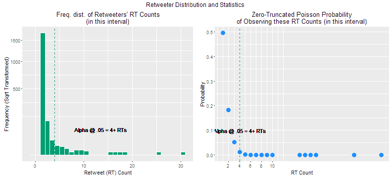

## Brand Ambassador Finder
The ultimate goal of this *marketing data science* application is to help brands identify their organic -and influential- *ambassadors*, efficiently and objectively.

In other words, the followers this app identifies are statistically significantly more likely to champion a given brand, for whatever reason, and are actually influential enough to make it worth a marketing dept's time to nudge into activities like...  

* Brand alignment
* Campaign coordination
* Quantitative / Qualitative research
* Etc, etc.

Brands hereby save tons of time and money on finding ambassadors they don't *have to* pay. :)


#### How It Works (in not-so-techy terms)

The app calls [Twitter's REST API](https://dev.twitter.com/rest/public) to get a specified brand's last N (user-defined count) of original tweets (not RTs). Then, it calls the Twitter API again to get the IDs of those tweets' retweeters and performs statistical analyses to see which of these users evidently retweet at a statistically significantly higher rate than the rest. Next, it calls [Klout's API](https://klout.com/s/developers/home) to check only these retweeters' Klout scores and cuts that list down even further, to those whose scores pass a specified K-score threshold.  

#### Status

* I'm about 90% done.
* The only things left to do are to overcome Twitter's API rate limits for retweeters per tweet (just 60 per 15 mins) and for user lookups (just 100 per 15 mins). When it comes to the former, unfortunately, requesting retweeters across all requested tweets only results in a list of unique retweeters across those tweets, not retweeters per tweet (i.e. no frequency table possible), so I have to loop through requests per retweeter ID, *then* create a frequency table.
* Working on two possible solutions:
    + A proxy solution to spread API calls between multiple proxied IPs. *This option should be easier to execute.*
    + A compute cluster solution (in Microsoft Azure) to spread a *job's* API calls between multiple machines and then rejoin, per job, when complete.

#### See it for Yourself!

You can see the code (if this is the "-with-code" version of the README), along with some lower level tests, below. I'm purposefully using an imaginary friend's API keys, so I can execute and present you the test results.


#### User-Defined Specs.
First, let's reveal our test user's specified target brand, keyword filter (to avoid including  employees/resellers), and Klout score minimum. Here's what they requested.  


|                       |
|:----------------------|
|Brian Solis            |
|http://t.co/NTX8aUxFon |
|http://t.co/5SfnJrYjFZ |

```
## [1] "Klout Score Minimum: 45"
```

```
## [1] "Keyword Filter(s): altimeter, prophet, solis"
```

#### Exploratory Analysis: Target Brand's Retweet Counts
Before we perform any statistical 'magic,' we should plot the target brand's distribution of retweet counts, our actionable measure of follower engagement, to see what we're dealing with. As one might expect, retweet counts apparently follow a [Poisson distribution](http://bit.ly/1Rhvblu), since they are counts over time.  


#### The Target Brand's Top Tweets, by Retweet Count
Now, let's isolate the brand's top 60 tweets, by retweet count, then preview and save that list, in case we'd like to analyze its contents later. I'll elaborate on why we're using the top 60 before I complete this.


|created_at                     |text                                                                                                                                                 | retweet_count| favorite_count|
|:------------------------------|:----------------------------------------------------------------------------------------------------------------------------------------------------|-------------:|--------------:|
|Mon Dec 21 19:21:11 +0000 2015 |The Miss Universe Design Fail: This isn’t @IAmSteveHarvey's fault alone. #X https://t.co/MZtRWKn7dZ https://t.co/2Kur2GScFP                          |           105|            108|
|Fri Nov 27 17:20:52 +0000 2015 |The embrace…that moment when you have my attention &amp; I have yours &amp; we do something amazing. https://t.co/sovhXS6Wk8 https://t.co/Z4nKbxNn2Y |            97|            173|
|Sat Nov 07 18:02:07 +0000 2015 |The future is shaped by tech’s impact on society &amp; what's upset or inspired as a result https://t.co/xmyOCVJgRW https://t.co/qqG9uifR5N          |            96|             94|
|Tue Feb 09 19:20:27 +0000 2016 |"We need to rethink our strategy of hoping the Internet will just go away." - said, most executives you know https://t.co/qOYJcExTEk                 |            89|            111|
|Tue Jan 05 22:28:47 +0000 2016 |Look at how people use technology not at technology people use. #ces #ces2016 https://t.co/ZvKjjLi5zZ                                                |            84|            108|
|Mon Feb 29 16:49:39 +0000 2016 |Smart CMOs and CDOs Take an Opposite Approach to Digital Transformation [8 Success Factors] via @forbes https://t.co/XQJ9D0sVP1                      |            79|            112|
*You can [view the CSV output of top 60 tweets here >>](results/top100-tweets.csv)*  

#### 'Significant' Retweeters of Top Tweets
Here, we can see the total number of unique retweeters, across our top tweets, followed by plots of the following...

* The frequency distribution of retweeters per observed retweet count, vertically delineated at the point of statistical significance ($\alpha$ = .05).  
* The *Zero-Truncated Poisson* probabilities of observing these retweet counts. 
    + We're calculating "zero-truncated" Poisson probabilities, because, by their very definition, a *retweeter* cannot have a retweet count of "0," although Twitter followers can. ZTP probabilities are also a slightly more conservative measure for practical significance. [More on this in the Appendix below.>>](#appendix)  

We then preview and save these retweeters, while excluding those whose bios/descriptions contained the user's defined filter word.

*Please note: Until I overcome Twitter's API rate limits (soon!), these statistics are limited to those retweeters of the user brand's top 60 tweets, by retweet count. The relevant API rate limit is just 60 calls per 15 minutes (I'm splitting my calls between two accounts, for now).*


```
## [1] "Unique retweeters of top tweets:  1891"
```



| RT_count|id_str     |name               |description                                                                                                                                                                                   |
|--------:|:----------|:------------------|:---------------------------------------------------------------------------------------------------------------------------------------------------------------------------------------------|
|       30|180317088  |Roberto Re         |Ich bin ein Mailänder. Networker, Security analytical thinker, Fulltime student of the news, RT=FYI. ½ROBot #TweetMI #Milano , ingegnere.                                                     |
|       25|1124048252 |blackprmachine     |To win today PR must be Social and Mobile. Our winning formula is DSMD=Disrupt. Social . Mobile . Digital.                                                                                    |
|       18|939853778  |Beat Digital       |A Beat Digital é uma agência especializada em marketing digital e blogs. #MarketingDigital #dicaswordpress #redessociais #onlinemarketing #marketingmix #blogs                                |
|       17|251286406  |Warren Lee         |Pianist, teacher, REALpreneur, and businessman. I love knowledge and the grind. My latest piano cover: Alla Turca Jazz <U+2B07><U+FE0F><U+2B07><U+FE0F><U+2B07><U+FE0F> link below. NO DM PLS |
|       16|3900651875 |Estratégia Digital |O Blog Estratégia Digital é um ponto de encontro sobre marketing digital.  #MarketingDigital #dicaswordpress #redessociais #onlinemarketing #marketingmix                                     |
|       15|872276665  |Julio Liarte       |Antes era funcionario... ahora, EMPRENDEDOR LIBRE!! Creador del sistema http://t.co/By1WfDh1aJ                                                                                                |

*You can [view the CSV output of retweeters here >>](results/retweeters.csv)*  

#### Checking Klout (ID and Score)

Just to check Klout's API, and our integration of it, let's get the Klout ID and Klout score of a single test retweeter. Then, we'll filter our list of statistically significantly engaged users down to those who meet or exceed our Klout score minimum.


```
## [1] "5348029325654862"
```

```
## [1] "Test Twitter handle: robertore62 --- Name: Roberto Re --- Klout score: 68.475"
```

#### Finally, Your Brand Ambassadors...

Below is a preview of your *brand ambassadors*... or those retweeters who are *actually* -and organically- interested in sharing the user brand's content, likely weren't *of* the user brand, and *do* meet the user's desired minimum Klout score. This is followed by a link to download the full list. 

*Please note again: until I overcome Twitter's API rate limit (soon), the total possible brand ambassadors is necessary limited.*  


```
## [1] "Total brand ambassadors identified: 24"
```


| RT_Count|Name               |Twitter_Handle |URL                     |Description                                                                                                                                                                                   | Klout_Score|
|--------:|:------------------|:--------------|:-----------------------|:---------------------------------------------------------------------------------------------------------------------------------------------------------------------------------------------|-----------:|
|       30|Roberto Re         |robertore62    |https://t.co/66RPiwGoLA |Ich bin ein Mailänder. Networker, Security analytical thinker, Fulltime student of the news, RT=FYI. ½ROBot #TweetMI #Milano , ingegnere.                                                     |       68.48|
|       18|Beat Digital       |BeatDigitalMkt |http://t.co/4h7eGNITdV  |A Beat Digital é uma agência especializada em marketing digital e blogs. #MarketingDigital #dicaswordpress #redessociais #onlinemarketing #marketingmix #blogs                                |       50.09|
|       17|Warren Lee         |RhapsodyStudio |https://t.co/gjzZe5a1O7 |Pianist, teacher, REALpreneur, and businessman. I love knowledge and the grind. My latest piano cover: Alla Turca Jazz <U+2B07><U+FE0F><U+2B07><U+FE0F><U+2B07><U+FE0F> link below. NO DM PLS |       45.90|
|       16|Estratégia Digital |blogestrategia |http://t.co/4h7eGNITdV  |O Blog Estratégia Digital é um ponto de encontro sobre marketing digital.  #MarketingDigital #dicaswordpress #redessociais #onlinemarketing #marketingmix                                     |       48.11|
|       15|Julio Liarte       |reliarte       |http://t.co/J1rZvZASPE  |Antes era funcionario... ahora, EMPRENDEDOR LIBRE!! Creador del sistema http://t.co/By1WfDh1aJ                                                                                                |       45.55|
|       10|Shaun Dakin        |DakinMarketing |http://t.co/7LFfJvu7kA  |Twitter account for GMU Marketing Class with Professor @ShaunDakin  Current Hashtag #GMU315                                                                                                   |       46.28|
*[View your full Brand Ambassadors list in CSV format >>](results/brand-ambassadors.csv)*  

***

### Thank you.
If you have questions or would like to license this little application of mine, please feel free to get in touch. I hope you like it so far!  
[Connect on LinkedIn](http://linkd.in/1BGeytb)  //  [Follow on Twitter](http://bit.ly/1vUz1Ub)  
[My Quora answers](http://bit.ly/1LwktEb)  //  [Follow on Slideshare](http://bit.ly/1ibo53P)

***

### <a name="appendix"></a>Appendix: A Word about Poisson vs. Zero-Truncated Poisson Distributions

As alluded to above, a *zero-truncated* Poisson distribution isn't exactly the same thing as a Poisson distribution that has simply been shifted to the right (i.e. beginning at 1). The total probability of a shifted Poisson would still equal 1, whereas the total probability of a zero-truncated Poisson gets corrupted by cutting off its zeros. Its *probability mass function* must therefore be adjusted to scale the distribution back to a total probability of 1.  

* This actually results in raising the distribution's lower end, so, for this application, it helps us be more conservative about who we identify as brand ambassadors.

* One can see the above in comparing the Poisson and Zero-Truncated Poisson probabilities of our retweeters' unique retweet count values below. Pay particular attention to the point at which each goes below goes below our alpha (.05)...


| RT_count|    p_pois|  ztp_pois|
|--------:|---------:|---------:|
|       30| 0.0000000| 0.0000000|
|       25| 0.0000000| 0.0000000|
|       18| 0.0000000| 0.0000000|
|       17| 0.0000000| 0.0000000|
|       16| 0.0000000| 0.0000000|
|       15| 0.0000000| 0.0000000|
|       10| 0.0000001| 0.0000001|
|        9| 0.0000008| 0.0000011|
|        8| 0.0000063| 0.0000088|
|        7| 0.0000463| 0.0000652|
|        6| 0.0003046| 0.0004287|
|        5| 0.0017632| 0.0024816|
|        4| 0.0088234| 0.0124188|
|        3| 0.0373021| 0.0525022|
|        2| 0.1292020| 0.1818498|
|        1| 0.3516199| 0.4948998|

```
## [1] "Alpha if Poisson: 3 or more retweets."
```

```
## [1] "Alpha if Zero-Truncated Poisson: 4 or more retweets."
```

For a richer explanation of the above phenomena and how to adjust a Poisson's traditional probability mass function accordingly, [check out this elegant post by "Glen_b" at StackExchange.com >>](http://bit.ly/1RgeJkd).  

***

##### market research, data science for marketing, branding, brand management, jude calvillo, data science, inferential statistics
##### Hashtag #whynotSEOthis? :)
